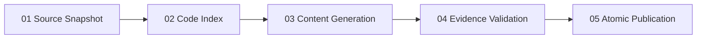

# RepoLens production pipeline

> Historical design only. The current production contract is
> [the fixed five-stage reference pipeline](./five-stage-reference-pipeline.md): one bounded
> report generation call, deterministic evidence validation, and atomic publication without an
> automatic semantic/readability repair loop.

## Product decision

RepoLens is a CLI product with an optional orchestration skill. The production
owner is the Python pipeline, not a conversational skill and not `cli.py`.
`cli.py` only parses arguments and routes commands. The product pipeline owns
deterministic indexing, provider execution, caching, validation, progress, and
publication.

## Reference adoption

RepoLens now follows five explicit reference decisions:

| Reference | RepoLens decision |
| --- | --- |
| Understand Anything | Adopt a fixed five-stage pipeline with durable stage records and resumable caches. |
| RepoAgent / CodeGraph | Treat symbols, files, calls, module relations, and CodeGraph paths as the fact layer. |
| Repomix | Build a bounded evidence packet instead of sending the whole repository to the model. |
| DeepWiki | Render reports in the reading order `project -> capabilities -> implementation evidence`. |
| GitDiagram | Generate text and diagrams from the same runtime/interaction data, not from a second interpretation pass. |

The primary report is for human technology selection, so business capabilities
are the top-level reading unit. Files, routes, health checks, CRUD shells,
examples, and generic UI primitives are evidence or support modules unless they
independently deliver a real user outcome.

## Fixed runtime stages

The `report` command is a strict five-stage sequence. It does not contain
semantic repair loops, readability gates, or model-driven retries.

### 01 Source Snapshot

- Freeze one consistent repository view.
- Prepare CodeGraph before indexing.
- Exclude generated outputs and snapshot directories from evidence.
- Expand initialized git submodules so the report sees the actual checked-out code.

### 02 Code Index

- Build the canonical index: files, symbols, relationships, evidence, module graph.
- Build the capability graph from the canonical index.
- Build the bounded analysis pack from canonical evidence.
- This stage is deterministic. No business prose is generated here.

### 03 Content Generation

- Make exactly one structured model call for the public report.
- Input is a bounded pack with project navigation, graph evidence, source excerpts, and capability hints.
- Output already contains:
  - project summary and engineering structure
  - ordered business capabilities
  - runtime story / state flow
  - mechanism model / difficulty / boundaries / reuse
- There is no extra readability-review stage in the production path.

### 04 Evidence Validation

- Rebind snapshot paths back to the real repository root.
- Validate schema, file paths, line ranges, source refs, and evidence closure.
- Materialize deterministic chapter sidecars and validation sidecars.
- If evidence does not close, the run fails here. It does not auto-repair.

### 05 Atomic Publication

- Publish JSON, HTML, and sidecars in one generation switch.
- Publish the fixed stage ledger after the switch to avoid circular publication dependencies.
- Record performance with the same five-stage contract shown by the UI.

## Caching contract

Stage reuse is content-addressed.

- Source snapshot reuse depends on source identity.
- Code index reuse depends on indexed content.
- Content-generation reuse depends on:
  - bounded packet digest
  - human-report prompt digest
  - human-report schema digest
  - provider/model contract
- Publication reuse depends on the validated generation payload.

This is the first-principles fix for stale-report reuse: changing prompt,
schema, or provider must invalidate stage 03 even if the repository content is
unchanged.

## Package seams

- `commands`: application commands; CLI adapters only.
- `pipeline`: stage sequencing, snapshotting, caching, validation, progress, and publication helpers.
- `providers`: Codex, OpenCode, DeepSeek transport, timeout, and JSON execution.
- `prompts`: versioned prompt resources.
- `agents`: role contracts used by prompt/schema resources.
- `schemas`: structured-output contracts.
- `renderers`: JSON-to-HTML presentation only.
- `skills/repository-report`: invokes the same CLI; does not reimplement pipeline logic.

## Main pipeline modules

| Module | Responsibility |
| --- | --- |
| `pipeline/source_snapshot.py` | stable repository snapshot, submodule expansion |
| `pipeline/codegraph.py` | CodeGraph preparation and scoped graph extraction |
| `pipeline/evidence_packets.py` | bounded evidence packets and source excerpts |
| `pipeline/cache_identity.py` | content-addressed identities for caches and workspaces |
| `pipeline/synthesis.py` | one-shot human report generation and cache binding |
| `pipeline/report_contracts.py` | evidence closure and report normalization |
| `pipeline/report_outputs.py` | deterministic publication sidecars |
| `pipeline/linear_pipeline.py` | fixed public five-stage ledger |
| `pipeline/journal.py` | detailed execution journal and performance accounting |

## Human reading contract

The published report must read in this order:

1. What project this is.
2. What kind of engineering structure it has.
3. What the core capabilities are, in product importance order.
4. How each capability runs end-to-end.
5. Which implementation mechanism makes it work.
6. What the true difficulty, boundaries, and tradeoffs are.
7. Which files and lines support each conclusion.

This is why RepoLens adopts the DeepWiki reading order but rejects a
module-first report taxonomy.
